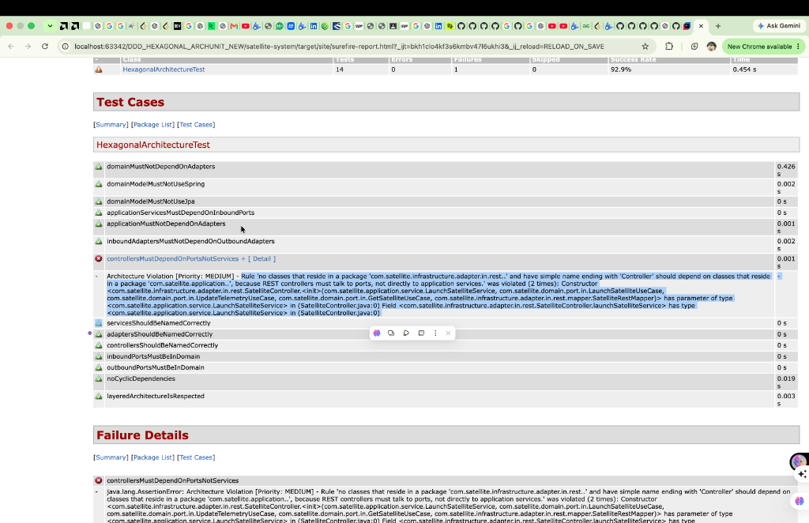
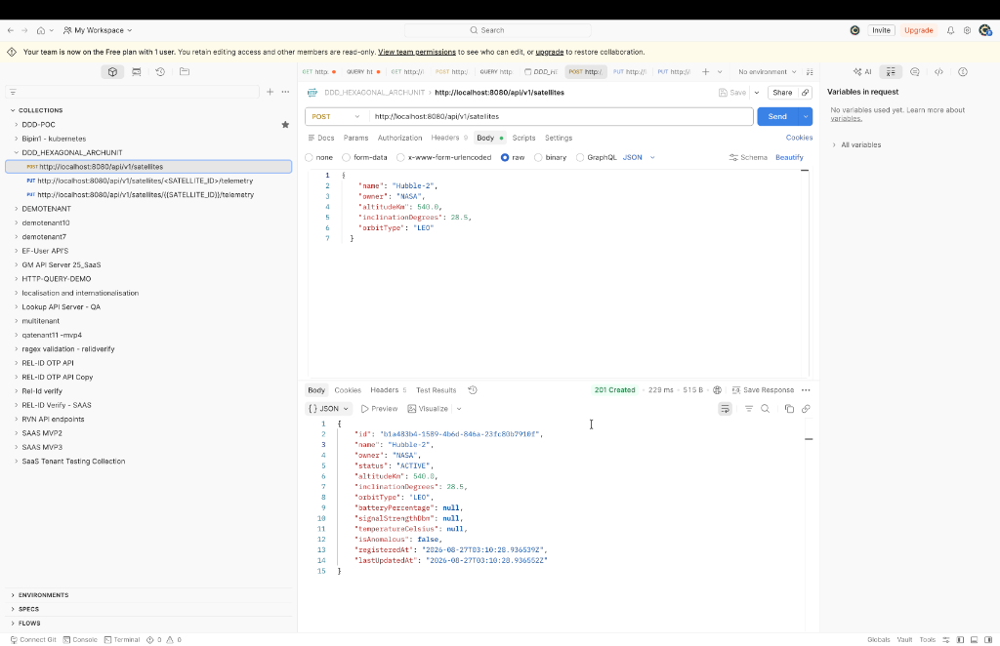
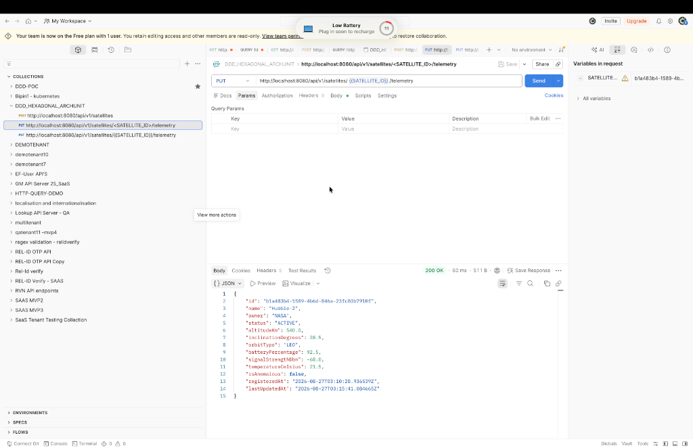
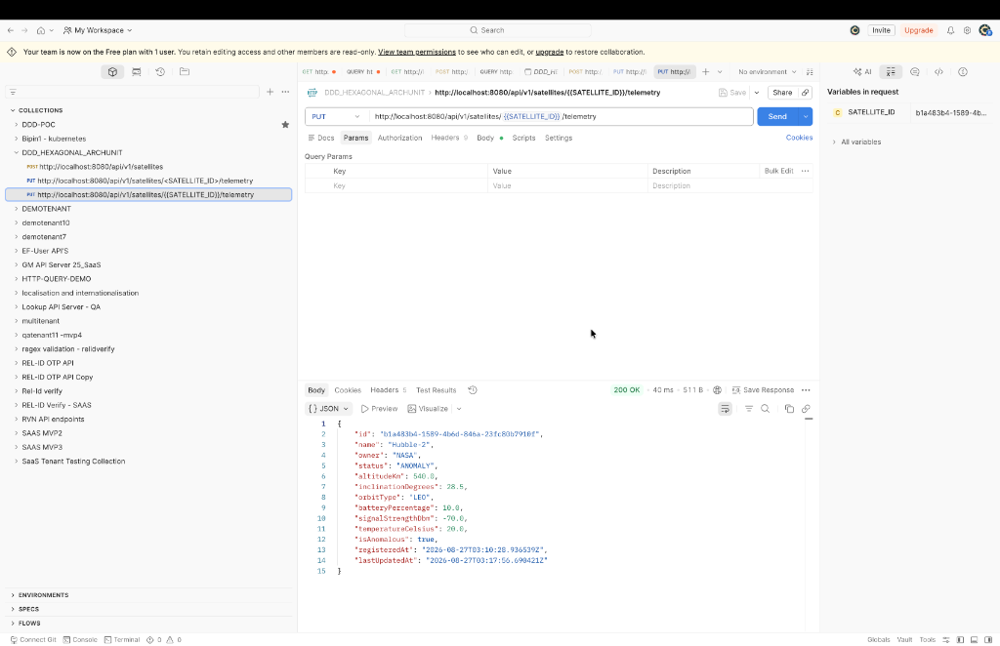

# 🛰️ Satellite Management System — DDD + Hexagonal Architecture + ArchUnit

A production-ready Spring Boot 3 reference project demonstrating **Domain-Driven Design (DDD)**, **Hexagonal Architecture (Ports & Adapters)**, **Herberto Graça's Explicit Architecture**, and **ArchUnit Automated Architecture Enforcement**, using a **Satellite Management System** as the domain context.

[](https://openjdk.org/projects/jdk/21/)
[](https://spring.io/projects/spring-boot)
[](https://www.archunit.org/)
[]()

---

## 📊 PowerPoint Presentation Deck (FINAL Version)

- **Presentation File**: [Satellite_Architecture_DDD_Hexagonal_ArchUnit_FINAL.pptx](file:///Users/bipin/.gemini/antigravity/scratch/satellite-system/Satellite_Architecture_DDD_Hexagonal_ArchUnit_FINAL.pptx)
- **GitHub Presentation Download**: [hykuBipin/DDD_HEXAGONAL_ARCHUNIT_NEW (Satellite_Architecture_DDD_Hexagonal_ArchUnit_FINAL.pptx)](https://github.com/hykuBipin/DDD_HEXAGONAL_ARCHUNIT_NEW/blob/main/Satellite_Architecture_DDD_Hexagonal_ArchUnit_FINAL.pptx)

---

## 📸 Visual Evidence & Screenshots

| Surefire HTML Report ArchUnit Layer Failure | Postman POST Launch Satellite |
|---|---|
|  |  |

| Postman Normal Telemetry (HTTP 200 OK) | Postman Anomaly Trigger (Status: ANOMALY) |
|---|---|
|  |  |

---

## 📌 Executive Summary Table: What, Why, Components, Implementation, & Challenges

| Aspect | 1. Domain-Driven Design (DDD) | 2. Hexagonal Architecture (Ports & Adapters) | 3. ArchUnit Architecture Enforcement |
|---|---|---|---|
| **What is it?** | A software design methodology focused on modeling complex business domains around core domain logic. | An architectural pattern isolating core logic inside a Hexagon using Inbound/Outbound Ports & Adapters. | A Java architecture testing framework that checks compiled bytecodes via fluent JUnit 5 tests. |
| **Why do we need it?** | Prevents Anemic Domain Models; bridges business stakeholders and developers using a Ubiquitous Language. | Decouples business rules from databases, web frameworks, and UI; enables instant unit testing (0.01s). | Automates architecture governance in CI/CD; prevents monolithic degradation and layer boundary leaks. |
| **Project Components** | `Satellite.java` (Aggregate Root), `Orbit.java` & `Telemetry.java` (Value Objects), `SatelliteLaunchedEvent`. | Driving Adapters (`SatelliteController`), Driving Ports (`LaunchSatelliteUseCase`), Driven Ports (`SatelliteRepository`), Driven Adapters (`SatelliteJpaAdapter`, `SatelliteMongoAdapter`). | 11 Build Gates in `HexagonalArchitectureTest.java` enforcing layer hierarchy and class naming rules. |
| **How to Implement?** | Write pure Java records/entities in `com.satellite.domain`; keep zero Spring/JPA annotations in model. | Structure inward packages (`infrastructure` → `application` → `domain`); wire dependencies in `BeanConfig.java`. | Add `archunit-junit5`, annotate test class with `@AnalyzeClasses`, and write `@ArchTest` rules. |
| **Challenges & Mitigations** | Initial learning curve & domain boundary discovery -> Solved with Ubiquitous Language glossary. | Mapping overhead (Domain <-> DTO <-> Entity) -> Solved with dedicated mappers (`SatellitePersistenceMapper`). | Retrofitting legacy codebases -> Solved with `FreezingArchRule` to freeze existing technical debt. |

---

## ❓ Does ArchUnit Run as Pre-Build or Post-Build?

ArchUnit runs **DURING THE TEST PHASE (`mvn test`)** — which is **Post-Compilation** of bytecode, but **Pre-Packaging (`mvn package`) & Pre-Deployment (`mvn deploy`)**:

```text
 1. Compile Code        2. Execute ArchUnit Rules        3. Package Artifact       4. Deploy App
┌──────────────────┐    ┌───────────────────────────┐    ┌──────────────────┐    ┌─────────────────┐
│  mvn compile     │───►│  mvn test                 │───►│  mvn package     │───►│  mvn deploy     │
│  (Generates      │    │  (ArchUnit analyzes       │    │  (Generates      │    │  (Pushes to     │
│   .class files)  │    │   compiled bytecodes)     │    │   JAR / WAR)     │    │   Staging/Prod) │
└──────────────────┘    └───────────────────────────┘    └──────────────────┘    └─────────────────┘
                                   │
                           ❌ VIOLATION FOUND
                                   │
                                   ▼
                         🛑 BUILD FAILS IMMEDIATELY!
                         (Package & Deployment are BLOCKED)
```

---

## 🖼️ Architecture Diagram Visualizations

The project includes **5 high-definition graphic diagrams** modeled directly after classical architectural specifications ([Herberto Graça Explicit Architecture](https://github.com/mehdihadeli/awesome-software-architecture/blob/main/docs/hexagonal-architecture.md) & WATA Factory Hexagonal standards):

1. **Herberto Graça Explicit Architecture (`diagram_explicit_architecture.png`)**: Synthesizes DDD, Hexagonal, Clean, and Onion Architecture into explicit application boundaries. Maps Primary Adapters (REST Controllers / CLI), Application Core (Use Cases & Commands), Domain Layer (Aggregates & Value Objects), and Secondary Adapters (JPA / Mongo / Messaging).
2. **Primary & Secondary Adapters (`diagram_hexagonal_primary_secondary.png`)**: Visualizes Primary/Driving Adapters on the left (`SatelliteController.java`), Application Use Cases in the middle (`LaunchSatelliteService.java`), Domain Core in the center (`Satellite.java`), and Secondary/Driven Adapters on the right (`SatelliteJpaAdapter.java` -> SQL DB, `SatelliteMongoAdapter.java` -> NoSQL DB).
3. **Concentric Layered Onion Architecture (`diagram_onion_concentric.png`)**: Concentric ring view enforcing the inward dependency rule.
4. **DDD Ubiquitous Language & Subdomains (`diagram_ddd_ubiquitous_language.png`)**: Distills Problem Domain, Ubiquitous Language, Core Subdomain, Supporting Subdomain, and Generic Subdomain.
5. **Multi-Database Adapter Swapping Demo (`diagram_adapter_swapping.png`)**: Demonstrates how `SatelliteRepository` outbound port seamlessly switches between Relational DB (`SatelliteJpaAdapter`) and NoSQL Document DB (`SatelliteMongoAdapter`) with **zero changes to Domain Core**.

---

## 🔌 Hexagonal Superpower: Multi-Database Adapter Swapping Demo

### Outbound Port (Domain Contract)
Located in `com.satellite.domain.port.out.SatelliteRepository`:
```java
public interface SatelliteRepository {
    Satellite save(Satellite satellite);
    Optional<Satellite> findById(SatelliteId id);
    List<Satellite> findAll();
    boolean existsById(SatelliteId id);
}
```

### Driven Adapter 1: Relational SQL DB (JPA / H2 / PostgreSQL)
Located in `com.satellite.infrastructure.adapter.out.persistence.SatelliteJpaAdapter`:
```java
@Component
@Profile("jpa") // Active for SQL databases
public class SatelliteJpaAdapter implements SatelliteRepository {

    private final SatelliteJpaRepository jpaRepository;
    private final SatellitePersistenceMapper mapper;

    @Override
    public Satellite save(Satellite satellite) {
        SatelliteJpaEntity entity = mapper.toJpaEntity(satellite);
        SatelliteJpaEntity saved  = jpaRepository.save(entity);
        return mapper.toDomainEntity(saved);
    }
}
```

### Driven Adapter 2: NoSQL Document DB (MongoDB)
Located in `com.satellite.infrastructure.adapter.out.persistence.SatelliteMongoAdapter`:
```java
@Component
@Profile("mongo") // Active for NoSQL Document DBs
public class SatelliteMongoAdapter implements SatelliteRepository {

    private final MongoTemplate mongoTemplate;
    private final SatelliteMongoMapper mapper;

    @Override
    public Satellite save(Satellite satellite) {
        SatelliteDocument doc = mapper.toDocument(satellite);
        SatelliteDocument saved = mongoTemplate.save(doc);
        return mapper.toDomainEntity(saved);
    }
}
```

---

## 📐 Package Structure (JonathanM2ndoza Standard)

```text
com.satellite/
├── domain/                                      (Inner Hexagon — Pure Java)
│   ├── model/
│   │   ├── Satellite.java                       (Aggregate Root & State Machine)
│   │   ├── Orbit.java                           (Value Object — Altitude & Inclination Rules)
│   │   ├── Telemetry.java                       (Value Object — Anomaly Detection Rules)
│   │   ├── SatelliteId.java                     (Strongly-typed UUID Record)
│   │   └── SatelliteStatus.java                 (Lifecycle Enum)
│   ├── event/
│   │   ├── SatelliteLaunchedEvent.java          (Domain Event)
│   │   └── AnomalyDetectedEvent.java            (Domain Event)
│   ├── exception/
│   │   └── SatelliteDomainException.java        (Domain Exception)
│   └── port/
│       ├── in/                                  (Driving Ports — Use Case Contracts)
│       │   ├── LaunchSatelliteUseCase.java
│       │   ├── UpdateTelemetryUseCase.java
│       │   └── GetSatelliteUseCase.java
│       └── out/                                 (Driven Ports — Infrastructure Contracts)
│           ├── SatelliteRepository.java
│           └── SatelliteEventPublisher.java
│
├── application/                                 (Use Case Orchestration — Pure Java)
│   └── service/
│       ├── LaunchSatelliteService.java
│       ├── UpdateTelemetryService.java
│       └── GetSatelliteService.java
│
├── infrastructure/                              (Adapters & Technical Concerns)
│   ├── adapter/
│   │   ├── in/rest/                             (Driving Adapter — REST Controller)
│   │   │   ├── SatelliteController.java
│   │   │   ├── dto/                             (HTTP Requests & Responses)
│   │   │   └── mapper/                          (Domain <-> DTO Mapper)
│   │   └── out/
│   │       ├── persistence/                     (Driven Adapters — JPA / MongoDB)
│   │       │   ├── SatelliteJpaAdapter.java
│   │       │   ├── entity/                      (SatelliteJpaEntity & SatelliteJpaRepository)
│   │       │   └── mapper/                      (Domain <-> JPA Mapper)
│   │       └── messaging/                       (Driven Adapter — Spring Event Publisher)
│   │           └── SatelliteEventPublisherAdapter.java
│   └── config/                                  (Spring Composition Root)
│       └── BeanConfig.java
│
└── SatelliteSystemApplication.java
```

---

## 🛡️ ArchUnit Architecture Rules Explained

`HexagonalArchitectureTest.java` contains **11 automated ArchUnit rules** that act as mandatory CI/CD build gates. If any rule is violated, `mvn test` fails immediately.

| Rule # | Rule Name | Description & Rationale |
|---|---|---|
| **Rule 1** | `domainMustNotDependOnAdapters` | `domain` package must NEVER import or depend on `infrastructure` or `application`. Guarantees domain purity. |
| **Rule 2** | `domainModelMustNotUseSpring` | Domain model classes must NOT use `@Component`, `@Service`, or `@Repository`. Business logic remains framework-free. |
| **Rule 3** | `domainModelMustNotUseJpa` | Domain model classes must NOT use `@Entity`, `@Table`, or JPA annotations. Database structure changes won't affect business logic. |
| **Rule 4** | `applicationServicesMustDependOnInboundPorts` | `application.service` classes must implement `domain.port.in` interfaces. |
| **Rule 5** | `applicationMustNotDependOnAdapters` | Application services orchestrate domain logic only via ports and must never depend on concrete adapters or database drivers. |
| **Rule 6** | `inboundAdaptersMustNotDependOnOutboundAdapters` | REST Controllers (`infrastructure.adapter.in`) cannot directly access DB Adapters (`infrastructure.adapter.out`). |
| **Rule 7** | `controllersMustDependOnPortsNotServices` | REST Controllers talk **only** to inbound port interfaces (`LaunchSatelliteUseCase`), never directly to service implementation classes. |
| **Rule 8** | `namingConventions` | Services end in `Service`, persistence adapters end in `Adapter`, and controllers end in `Controller`. |
| **Rule 9** | `portsMustResideInDomain` | Driving (`port.in`) and driven (`port.out`) port interfaces MUST be defined inside the `domain` package. |
| **Rule 10** | `noCyclicDependencies` | Enforces zero circular package dependencies between slices. |
| **Rule 11** | `layeredArchitectureIsRespected` | Strict layered access: `Infrastructure` → `Application` → `Domain` (inner hexagon cannot access outer layers). |

---

## 🧪 Validation & Testing Guide

### 1. Execute Automated Test Suite & ArchUnit Enforcement

Run all unit, integration, and ArchUnit architecture tests:

```bash
mvn clean test
```

**Expected Output**:
```text
[INFO] Running com.satellite.infrastructure.adapter.SatelliteControllerIntegrationTest
[INFO] Tests run: 4, Failures: 0, Errors: 0, Skipped: 0
[INFO] Running com.satellite.application.ApplicationServiceTest
[INFO] Tests run: 5, Failures: 0, Errors: 0, Skipped: 0
[INFO] Running com.satellite.architecture.HexagonalArchitectureTest
[INFO] Tests run: 14, Failures: 0, Errors: 0, Skipped: 0
[INFO] Running com.satellite.domain.SatelliteTest
[INFO] Tests run: 14, Failures: 0, Errors: 0, Skipped: 0
[INFO] 
[INFO] Results:
[INFO] Tests run: 37, Failures: 0, Errors: 0, Skipped: 0
[INFO] BUILD SUCCESS
```

---

### 2. Run Application Server Locally

Start the Spring Boot application:

```bash
mvn spring-boot:run
```

App starts at `http://localhost:8080`.

---

### 3. End-to-End API Testing with cURL

#### A. Launch a Satellite (`POST /api/v1/satellites`)

```bash
curl -X POST http://localhost:8080/api/v1/satellites \
  -H "Content-Type: application/json" \
  -d '{
    "name": "Hubble-2",
    "owner": "NASA",
    "altitudeKm": 540.0,
    "inclinationDegrees": 28.5,
    "orbitType": "LEO"
  }'
```

#### B. Query Satellite Details (`GET /api/v1/satellites/{id}`)

```bash
curl -X GET http://localhost:8080/api/v1/satellites/<SATELLITE_UUID>
```

#### C. Send Normal Telemetry Update (`PUT /api/v1/satellites/{id}/telemetry`)

```bash
curl -X PUT http://localhost:8080/api/v1/satellites/<SATELLITE_UUID>/telemetry \
  -H "Content-Type: application/json" \
  -d '{
    "batteryPercentage": 92.5,
    "signalStrengthDbm": -68.0,
    "temperatureCelsius": 21.5
  }'
```

#### D. Trigger Anomaly & Domain Event (`PUT /api/v1/satellites/{id}/telemetry`)

Send low battery (< 15%) to trigger `ANOMALY` state transition:

```bash
curl -X PUT http://localhost:8080/api/v1/satellites/<SATELLITE_UUID>/telemetry \
  -H "Content-Type: application/json" \
  -d '{
    "batteryPercentage": 10.0,
    "signalStrengthDbm": -70.0,
    "temperatureCelsius": 20.0
  }'
```

#### E. List All Satellites (`GET /api/v1/satellites`)

```bash
curl -X GET http://localhost:8080/api/v1/satellites
```

---

### 4. Test Architecture Rule Violation (Live ArchUnit Enforcement Demo)

1. Open `src/main/java/com/satellite/domain/model/Satellite.java`.
2. Add a forbidden import:
   ```java
   import org.springframework.stereotype.Component;
   ```
3. Run `mvn test`.
4. **ArchUnit output**:
   ```text
   Architecture Violation [Priority: MEDIUM] - Rule 'no classes residing in domain.model should be annotated with @Component' was violated.
   ```
